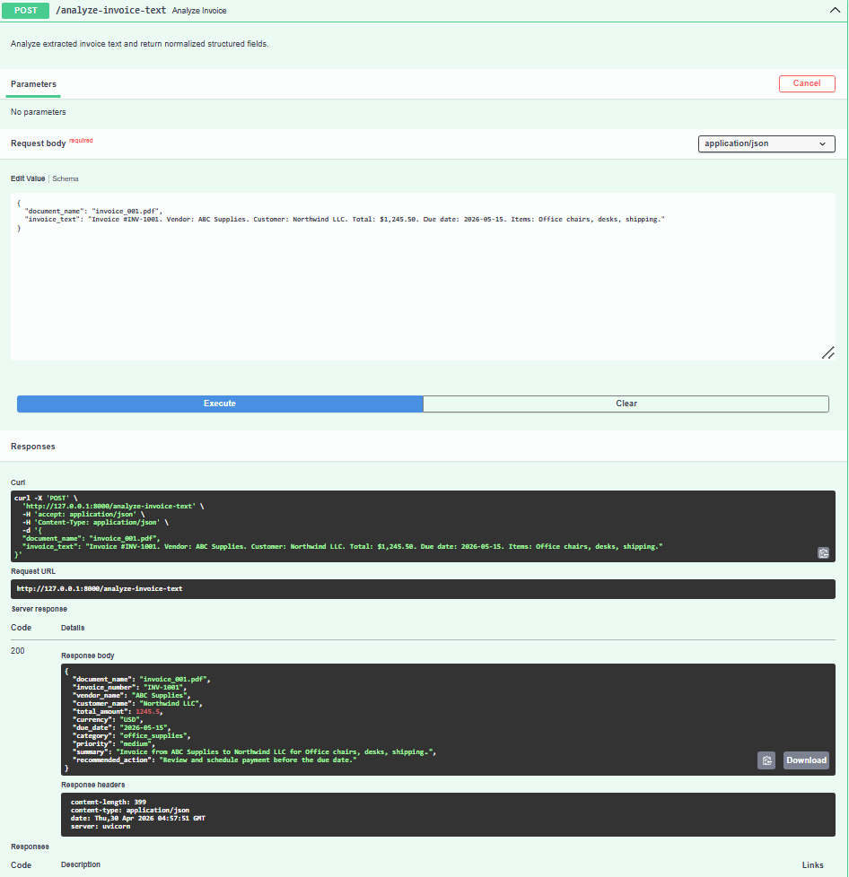

# AI PDF / Invoice Analyzer API

## Project Overview

This project is a portfolio-ready FastAPI backend that accepts extracted invoice text and returns structured invoice analysis using the **OpenAI API** (real LLM calls, not placeholder regex).  
It demonstrates backend API design, input/output validation, and AI-ready service architecture for automation workflows.

## Business Use Case

Accounts payable teams often receive invoices in inconsistent formats.  
This API standardizes invoice data into predictable fields so downstream systems can automate:

- invoice triage
- payment scheduling
- finance dashboard reporting
- approval routing

## Tech Stack

- Python
- FastAPI
- Pydantic
- Uvicorn
- OpenAI Python SDK
- python-dotenv
- pytest, httpx (automated tests)

## Running Tests

Tests mock the OpenAI client and do not call the real API (safe without a key).

```bash
pip install -r requirements.txt
pytest
```

## Project Structure

```text
.
├── app/
│   ├── main.py
│   ├── schemas/
│   │   └── invoice_schema.py
│   └── services/
│       └── invoice_service.py
├── tests/
│   ├── conftest.py
│   └── test_analyze_invoice_text.py
├── .env.example
├── .gitignore
├── pytest.ini
├── README.md
└── requirements.txt
```

## Setup Instructions

1. Create and activate a virtual environment:

   ```bash
   python -m venv .venv
   # Windows PowerShell:
   .venv\Scripts\Activate.ps1
   ```

2. Install dependencies:

   ```bash
   pip install -r requirements.txt
   ```

3. Copy the environment template and set your OpenAI key:

   ```bash
   copy .env.example .env
   ```

   Edit `.env` and set `OPENAI_API_KEY` to a valid key. Without it, `POST /analyze-invoice-text` returns **503** with a clear error message.

4. Run the API:

   ```bash
   uvicorn app.main:app --reload
   ```

5. Open docs:

- Swagger UI: [http://127.0.0.1:8000/docs](http://127.0.0.1:8000/docs)
- ReDoc: [http://127.0.0.1:8000/redoc](http://127.0.0.1:8000/redoc)

## API Endpoint

### `POST /analyze-invoice-text`

Accepts simulated extracted invoice text and returns structured invoice analysis produced by OpenAI. If the OpenAI API fails, the server returns **502** with a clear error detail.

### Sample Request

```json
{
  "document_name": "invoice_001.pdf",
  "invoice_text": "Invoice #INV-1001. Vendor: ABC Supplies. Customer: Northwind LLC. Total: $1,245.50. Due date: 2026-05-15. Items: Office chairs, desks, shipping."
}
```

### Sample Response

```json
{
  "document_name": "invoice_001.pdf",
  "invoice_number": "INV-1001",
  "vendor_name": "ABC Supplies",
  "customer_name": "Northwind LLC",
  "total_amount": 1245.5,
  "currency": "USD",
  "due_date": "2026-05-15",
  "category": "office_supplies",
  "priority": "medium",
  "summary": "Invoice from ABC Supplies to Northwind LLC for Office chairs, desks, shipping.",
  "recommended_action": "Review and schedule payment before the due date."
}
```

## Screenshot

The screenshot below shows a successful POST /analyze-invoice-text request in FastAPI Swagger UI with a 200 response.



## Current Limitations

- Requires a valid `OPENAI_API_KEY` (no local/offline model)
- No PDF upload endpoint yet
- No real PDF text extraction pipeline yet
- Category and priority are guided by the model and normalized to allowed values when needed

## Future Improvements

- Optional Azure OpenAI or multi-provider support
- Add PDF upload support and extraction layer
- Add OCR support for scanned invoices
- Store results in a database (PostgreSQL)
- Add authentication and role-based access
- Expand CI pipeline (e.g. GitHub Actions running `pytest`)

